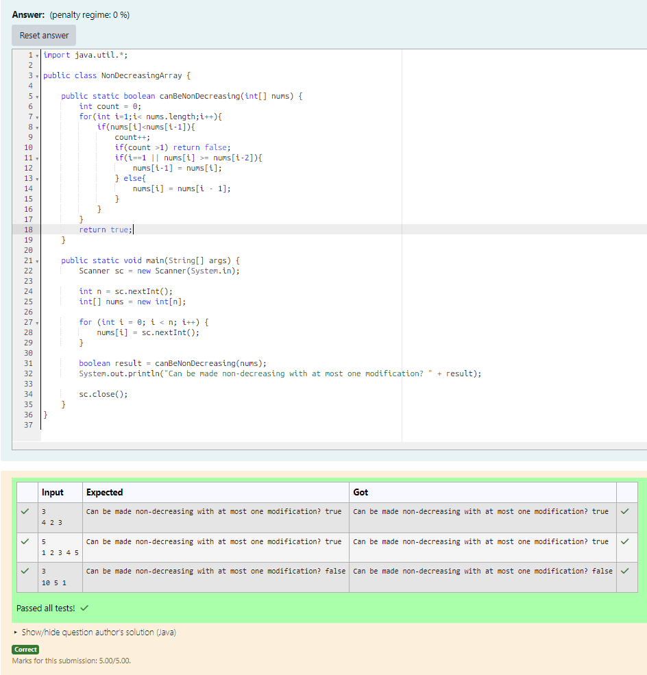

# EX 2A Assign Cookies using Greedy Algorithm.

## AIM:
To Write a Java program for the following Constraints.
Given an array nums with n Integers, your task is to check if it could become non-decreasing by modifying at most one element.
We define an array to be non-decreasing if nums[i] <= nums[i + 1] it holds for every i (0-based) such that (0 <= i <= n - 2).

## Algorithm
1. Start the program.

2. Read input:
   - Read integer `n` (size of array)
   - Input array `nums[]`

3. Initialize variables:
   - Set `count = 0` (to track modifications)

4. Traverse the array:
   - Loop from `i = 1` to `n-1`
   - If `nums[i] < nums[i-1]`:
     - Increment `count`
     - If `count > 1`, return false
     - If `i == 1` OR `nums[i] >= nums[i-2]`:
       - Modify `nums[i-1] = nums[i]`
     - Else:
       - Modify `nums[i] = nums[i-1]`

5. Output result:
   - If possible, print true
   - Otherwise print false
   - Stop the program

## Program:
```java
/*
Program to implement Reverse a String
Developed by: Junaid Sardar S
Register Number: 212224100028
*/

import java.util.*;

public class NonDecreasingArray {

    public static boolean canBeNonDecreasing(int[] nums) {
        int count = 0;
        for(int i=1;i< nums.length;i++){
            if(nums[i]<nums[i-1]){
                count++;
                if(count >1) return false;
                if(i==1 || nums[i] >= nums[i-2]){
                    nums[i-1] = nums[i];
                } else{
                    nums[i] = nums[i - 1];
                }
            }
        }
        return true;
    }

    public static void main(String[] args) {
        Scanner sc = new Scanner(System.in);
        int n = sc.nextInt();
        int[] nums = new int[n];
        for (int i = 0; i < n; i++) {
            nums[i] = sc.nextInt();
        }
        boolean result = canBeNonDecreasing(nums);
        System.out.println("Can be made non-decreasing with at most one modification? " + result);

        sc.close();
    }
}
```

## Output:

 
## Result:
The program successfully print all the numbers from 1 to N. 