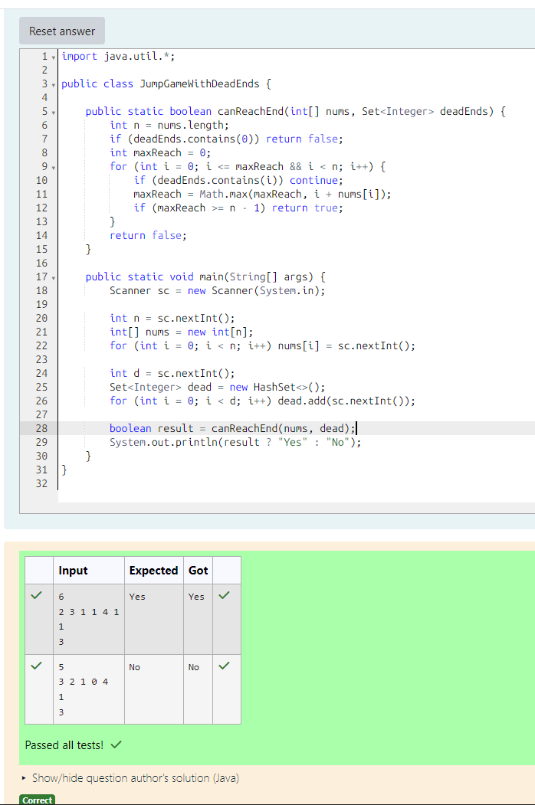

# EX 2B Jump Game using Greedy Algorithm.

## AIM:
To write a Java program to for given constraints.

You're given:
An array nums where each element nums[i] is the maximum jump length you can make from index i
A set of dead end indices (if you land on one, the game ends immediately)

Your goal:
Determine if you can reach the last index starting from index 0, without ever landing on a dead end.

## Algorithm
1. Start the program.

2. Read input:
   - Read integer `n` (size of array)
   - Input array `nums[]` representing jump lengths
   - Read integer `d` (number of dead ends)
   - Input dead-end indices into a set

3. Initialize variables:
   - Set `maxReach = 0`
   - If index `0` is a dead end, return false

4. Traverse the array:
   - Loop from `i = 0` to `maxReach`
   - If index `i` is a dead end, skip it
   - Update `maxReach = max(maxReach, i + nums[i])`
   - If `maxReach >= n - 1`, return true

5. Output result:
   - Print "Yes" if end is reachable
   - Otherwise print "No"
   - Stop the program

## Program:
```java
/*
Program to implement Reverse a String
Developed by: Junaid Sardar S
Register Number: 212224100028
*/

import java.util.*;

public class JumpGameWithDeadEnds {

    public static boolean canReachEnd(int[] nums, Set<Integer> deadEnds) {
        int n = nums.length;
        if (deadEnds.contains(0)) return false;
        int maxReach = 0;
        for (int i = 0; i <= maxReach && i < n; i++) {
            if (deadEnds.contains(i)) continue;
            maxReach = Math.max(maxReach, i + nums[i]);
            if (maxReach >= n - 1) return true;
        }
        return false;
    }

    public static void main(String[] args) {
        Scanner sc = new Scanner(System.in);

        int n = sc.nextInt();
        int[] nums = new int[n];
        for (int i = 0; i < n; i++) nums[i] = sc.nextInt();

        int d = sc.nextInt();
        Set<Integer> dead = new HashSet<>();
        for (int i = 0; i < d; i++) dead.add(sc.nextInt());

        boolean result = canReachEnd(nums, dead);
        System.out.println(result ? "Yes" : "No");
    }
}
```

## Output:


## Result:
The program successfully implemented and the expected output is verified.
