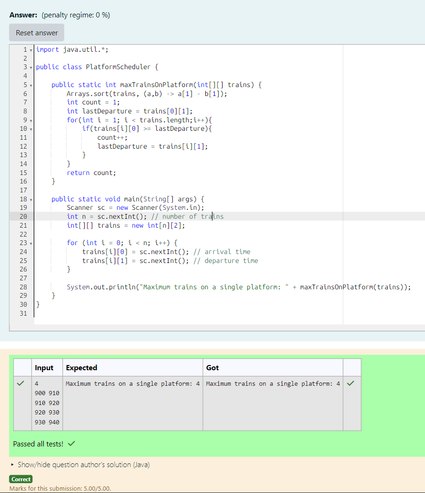

# EX 2C Job Sequencing using Greedy Approach

## AIM:
Given arrival and departure times of n trains, determine the maximum number of trains that can be accommodated on a single platform without overlapping schedules.

Rule:

Only one train can be on the platform at a time.

A train can arrive exactly when another departs (i.e., no overlap if arrival ≥ prev departure).

## Algorithm
1. Start the program.

2. Read input:
   - Read integer `n` (number of trains)
   - Input arrival and departure times for each train

3. Sort the trains:
   - Sort the trains based on departure time in ascending order

4. Apply greedy selection:
   - Initialize `count = 1` (first train is selected)
   - Set `lastDeparture` as departure time of first train
   - Traverse remaining trains:
     - If arrival time ≥ lastDeparture:
       - Select train
       - Increment count
       - Update lastDeparture

5. Output result:
   - Print the maximum number of trains that can use a single platform
   - Stop the program

## Program:
```java
/*
Program to implement Reverse a String
Developed by: Junaid Sardar S
Register Number: 212224100028  
*/

import java.util.*;

public class PlatformScheduler {

    public static int maxTrainsOnPlatform(int[][] trains) {
        Arrays.sort(trains, (a,b) -> a[1] - b[1]);
        int count = 1;
        int lastDeparture = trains[0][1];
        for(int i = 1; i < trains.length;i++){
            if(trains[i][0] >= lastDeparture){
                count++;
                lastDeparture = trains[i][1];
            }
        }
        return count;
    }

    public static void main(String[] args) {
        Scanner sc = new Scanner(System.in);
        int n = sc.nextInt(); // number of trains
        int[][] trains = new int[n][2];

        for (int i = 0; i < n; i++) {
            trains[i][0] = sc.nextInt(); // arrival time
            trains[i][1] = sc.nextInt(); // departure time
        }

        System.out.println("Maximum trains on a single platform: " + maxTrainsOnPlatform(trains));
    }
}
```

## Output:


## Result:
The program successfully implemented and the expected output is verified.
