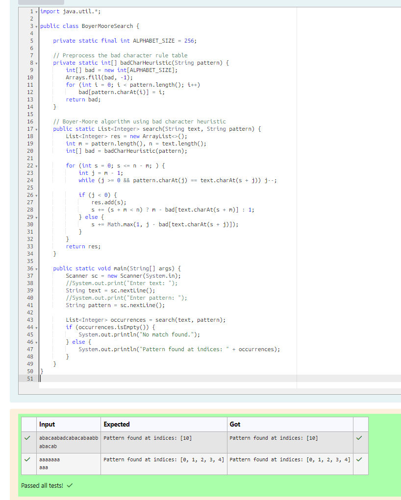

# EX 2D Pattern Matching using Naive Approach.

## AIM:
To write a Java program to for given constraints.
Given text string with length n and a pattern with length m, the task is to prints all occurrences of pattern in text.
Note: You may assume that n > m.

Examples: 

Input:  text = "THIS IS A TEST TEXT", pattern = "TEST"
Output: Pattern found at index 10

Input:  text =  "AABAACAADAABAABA", pattern = "AABA"
Output: Pattern found at index 0, Pattern found at index 9, Pattern found at index 12
## Algorithm

1. Start the program.

2. Read input:
   - Input the text string
   - Input the pattern string

3. Preprocess the pattern:
   - Create a bad character table of size 256
   - Store the last occurrence of each character in the pattern

4. Perform pattern matching:
   - Align pattern with text and compare from right to left
   - If mismatch occurs:
     - Use bad character rule to shift the pattern
   - If match is found:
     - Record the index
     - Shift pattern accordingly

5. Output result:
   - If matches found, print indices
   - Else print "No match found"
   - Stop the program

## Program:
```java
/*
Program to implement Reverse a String
Developed by: Junaid Sardar S
Register Number: 212224100028
*/

import java.util.*;

public class BoyerMooreSearch {

    private static final int ALPHABET_SIZE = 256;

    private static int[] badCharHeuristic(String pattern) {
        int[] bad = new int[ALPHABET_SIZE];
        Arrays.fill(bad, -1);
        for (int i = 0; i < pattern.length(); i++)
            bad[pattern.charAt(i)] = i;
        return bad;
    }

    public static List<Integer> search(String text, String pattern) {
        List<Integer> res = new ArrayList<>();
        int m = pattern.length(), n = text.length();
        int[] bad = badCharHeuristic(pattern);
    
        for (int s = 0; s <= n - m; ) {
            int j = m - 1;
            while (j >= 0 && pattern.charAt(j) == text.charAt(s + j)) j--;
    
            if (j < 0) {
                res.add(s);
                s += (s + m < n) ? m - bad[text.charAt(s + m)] : 1;
            } else {
                s += Math.max(1, j - bad[text.charAt(s + j)]);
            }
        }
        return res;
    }

    public static void main(String[] args) {
        Scanner sc = new Scanner(System.in);
        String text = sc.nextLine();
        String pattern = sc.nextLine();

        List<Integer> occurrences = search(text, pattern);
        if (occurrences.isEmpty()) {
            System.out.println("No match found.");
        } else {
            System.out.println("Pattern found at indices: " + occurrences);
        }
    }
}
```

## Output:


## Result:
The program successfully implemented and the expected output is verified.
