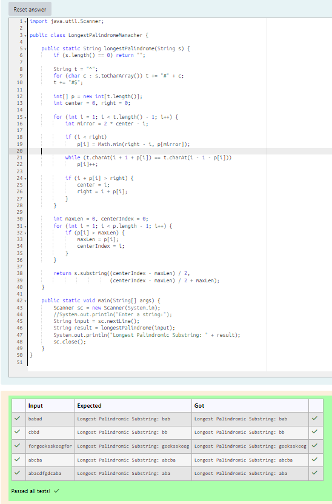

# EX 2E Pattern Matching using KMP Algorithm.

## AIM:
To write a Java program for the following constraints.
Longest Palindromic Substring
Given a string s, return the longest palindromic substring in s.
using Manacher's Algorithm

## Algorithm
1. Start the program.

2. Read input:
   - Input a string `s`

3. Transform the string:
   - Add special characters to handle even-length palindromes uniformly
   - Example: `"abba"` → `"^#a#b#b#a#$"`

4. Apply Manacher’s Algorithm:
   - Initialize array `p[]` to store palindrome lengths
   - Maintain variables `center` and `right`
   - For each position:
     - Use mirror property to minimize comparisons
     - Expand around center while characters match
     - Update center and right boundary

5. Find and output result:
   - Identify maximum length in `p[]`
   - Extract substring from original string
   - Print longest palindromic substring
   - Stop

## Program:
```java
/*
Program to implement Reverse a String
Developed by: Junaid Sardar S
Register Number: 212224100028
*/

import java.util.Scanner;
public class LongestPalindromeManacher {
    public static String longestPalindrome(String s) {
        if (s.length() == 0) return "";
        String t = "^";
        for (char c : s.toCharArray()) t += "#" + c;
        t += "#$";
        int[] p = new int[t.length()];
        int center = 0, right = 0;
        for (int i = 1; i < t.length() - 1; i++) {
            int mirror = 2 * center - i;
            if (i < right)
                p[i] = Math.min(right - i, p[mirror]);
            while (t.charAt(i + 1 + p[i]) == t.charAt(i - 1 - p[i]))
                p[i]++;
            if (i + p[i] > right) {
                center = i;
                right = i + p[i];
            }
        }
        int maxLen = 0, centerIndex = 0;
        for (int i = 1; i < p.length - 1; i++) {
            if (p[i] > maxLen) {
                maxLen = p[i];
                centerIndex = i;
            }
        }
        return s.substring((centerIndex - maxLen) / 2,
                           (centerIndex - maxLen) / 2 + maxLen);
    }
    public static void main(String[] args) {
        Scanner sc = new Scanner(System.in);
        String input = sc.nextLine();
        String result = longestPalindrome(input);
        System.out.println("Longest Palindromic Substring: " + result);
        sc.close();
    }
}
```

## Output:


## Result:
The program successfully implemented and the expected output is verified.
